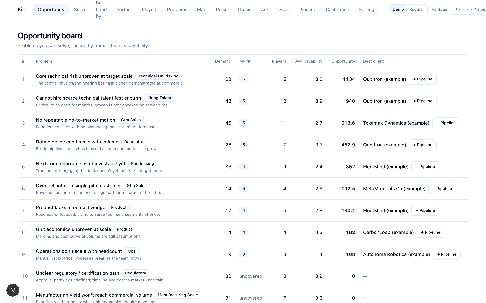
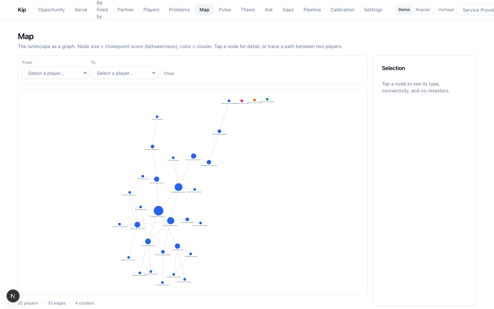

# Kip — Player Intelligence Platform

A multi-lens, vantage-relative, graph-native intelligence platform for understanding every
**player** in a deep-/emerging-tech landscape *"as if its business were yours"* — so you can
surface the **problems you can solve for them.**

> **This is a public overview.** The source code is **private and proprietary** —
> © 2026 Mike Psaras, all rights reserved. Available for review on request.

## The idea

Most market tools rank companies by generic firmographics. Kip flips it: it models each company
as a graph of facts, problems, and relationships, scores them *relative to your own position*
("vantage"), and turns that into a ranked board of concrete opportunities — then *learns* from how
those bets actually played out.

## What it does

- **Opportunity board** — your problems-you-can-solve, ranked by demand × fit × ability-to-pay.
- **Multi-lens scoring** — every company judged through several relationship lenses (serve,
  be-hired-by, compete, partner), always from *your* vantage point.
- **Calibration loop** — records real outcomes and grades its own past scores, so the system gets
  more honest over time.
- **AI-assisted, human-gated** — extract facts from documents and SEC filings, draft theses, fill
  gaps, and query the graph in plain English — with a review gate so nothing is saved without your
  approval.
- **Live data** — pulls real SEC EDGAR filings for tracked companies, with full provenance.
- **Runs anywhere** — a web app *and* a native macOS desktop app with an embedded database (no
  setup, no login).

## Screenshots

### Opportunity board — problems ranked by demand × fit × payability

### Landscape map — the market as a graph (node size = chokepoint centrality)

## Built with

TypeScript end-to-end · Next.js (App Router) · tRPC · Prisma · PostgreSQL · React · Tailwind ·
Electron + PGlite (desktop) · multi-provider AI (Claude / OpenAI / Gemini).

## Status

Actively developed. The source code is private and proprietary; reach out if you'd like a walkthrough.
